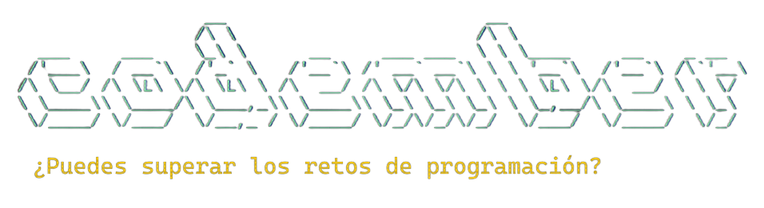

# Codember 2022

[Codember.dev](https://codember.dev), una de las nuevas webs de [Midudev](https://github.com/midudev) donde cada semana de noviembre subirá un nuevo reto. A parte, habrá secretos escondidos por la web. Al acabar noviembre los que han conseguido resolver todos los retos conseguirán un regalo :gift:.

## Retos :boom:

| Reto     | Título            |                                |
| -------- | ----------------- | ------------------------------ |
| 1        | ¡Arregla Twitter! | [Ver solución](./challenge01/) |

**Si ves cualquier tipo de error te agradezco la ayuda :wink:**

## Autor ✒️
**Jesús Martín Zorrilla**

Puedes contactar conmigo a través de mis [redes sociales](https://social-networks-jesusmarzor.vercel.app)

## Licencia 📄
Este proyecto está bajo la Licencia (GNU General Public License v3.0) - Mirar el archivo [LICENSE](LICENSE) para más detalles.